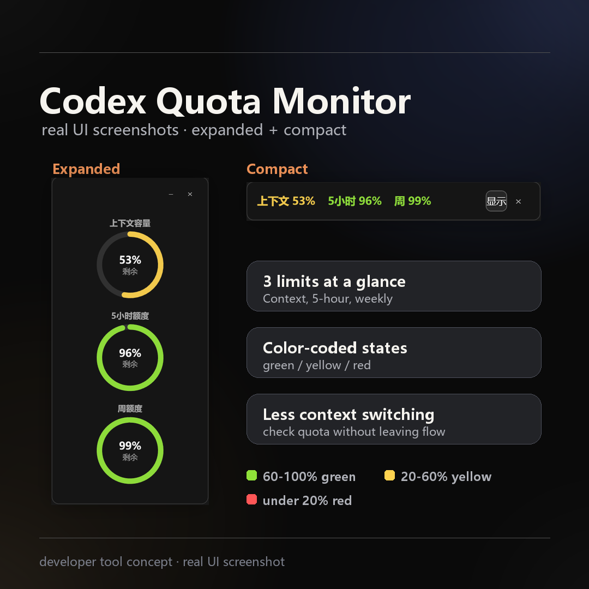

# Codex Quota Monitor / Codex 额度监控

Windows WPF companion overlay for Codex context usage and Codex rate limits.



> ⚠️ The preview image shows an earlier UI. The current build keeps the expanded three-gauge view and a horizontal compact bar; the old vertical compact layout has been removed.
> ⚠️ 上图为早期界面效果。当前版本保留竖向三圆环的展开模式和横向迷你条，旧的竖版迷你态已移除。

This plugin does not inject UI into Codex App. Codex plugins do not currently expose a native API for adding controls under the input box, so the visible part is a small local companion window.

---

## English

Codex Quota Monitor is an **unofficial** Windows companion overlay for the Codex desktop app. It keeps the most useful usage signals visible without opening settings or switching context.

### Features

- Three vertical circular gauges:
  - Current Codex conversation context remaining.
  - 5-hour usage limit remaining.
  - Weekly usage limit remaining.
- 5-hour and weekly reset times in expanded mode, plus available reset credits.
- A horizontal compact bar mode showing context / 5-hour / weekly percentages.
- A system-tray dot whose color reflects the 5-hour remaining percentage.
- Color states: green = 60-100% left, yellow = 20-60%, red = under 20%, gray = data unavailable.
- Reads context usage only from the current Codex session's bottom context indicator using UI Automation text. It does not read tooltips or chat content.
- Reads 5-hour and weekly limits from Codex app-server rate limit data.
- Follows the Codex window using a foreground WinEvent hook plus low-frequency fallback polling, so the overlay appears and hides with Codex.
- Supports Chinese, English, and French based on the Windows UI language.
- Supports manual collapse/show, hiding to the Windows system tray, dragging, double-click-to-tray, saved window position, and Windows sign-in startup scripts.

### Important Notes

- This is not an official OpenAI product.
- This project is not affiliated with, endorsed by, or supported by OpenAI.
- Windows only. macOS is not supported because this tool uses WPF, Win32 window hooks, and Windows UI Automation.

### Install (prebuilt binary)

1. Download `codex-quota-monitor-win-x64-v0.1.4.zip` from the [latest Release](../../releases/latest).
2. Extract the zip to any folder, for example `C:\Tools\CodexQuotaMonitor`.
3. Run `CodexUsageOverlay.App.exe`.
4. Open Codex. The overlay should appear automatically.

The package is self-contained, so you do not need to install the .NET Desktop Runtime separately.

### Run from source

Requires the .NET 10 SDK. From this folder:

```powershell
.\scripts\Start-CodexUsageOverlay.ps1
```

To start without rebuilding first:

```powershell
.\scripts\Start-CodexUsageOverlay.ps1 -NoBuild
```

The overlay starts `codex app-server --listen stdio://` for rate limit data. To attach to an existing websocket app-server endpoint, set `CODEX_USAGE_OVERLAY_APP_SERVER_WS` before launching the overlay.

### Windows Sign-In Startup

```powershell
.\scripts\Install-StartupShortcut.ps1 -Build   # install
.\scripts\Uninstall-StartupShortcut.ps1        # remove
```

### Usage

- Drag the overlay to move it.
- Click the minus button to collapse it to the compact bar; click `□` to expand again.
- Hover over the compact bar to see quota reset times.
- Double-click the overlay (or click the dot button) to hide it to the system tray; click the tray icon to restore.
- Close the overlay with the `x` button.

The overlay remembers its position and collapsed/expanded state.

### Requirements

- Windows 10/11 x64
- Codex desktop app installed
- You must be signed in to Codex

### How It Works

- Context remaining is read from the current Codex app UI indicator via Windows UI Automation.
- 5-hour and weekly quota values are read from Codex app-server rate limit data over local stdio.
- The overlay follows the Codex window and hides when Codex is not visible.
- The app does not send chat messages, does not type commands, does not use `/status`, does not take screenshots or run OCR, and does not move your mouse.

### Privacy & Network Behavior

This companion reads local Codex data and makes one low-frequency network call. Specifically:

- **Reads your local access token.** To show how many rate-limit reset credits you have, it reads the `access_token` from `~/.codex/auth.json` (the same credential file the Codex CLI maintains). The token stays in memory only; it is never written to disk and never logged.
- **One endpoint, at most once per day.** The token is used solely as a `Bearer` credential for a request to `https://chatgpt.com/backend-api/wham/rate-limit-reset-credits`. This request is made at most once per calendar day (and again only if the app is restarted before that day's fetch has succeeded).
- **No content is uploaded.** It does not upload chat content, prompts, source code, files, screenshots, or OCR text. It performs no screen capture, OCR, keyboard/mouse automation, or `/status` injection.
- **Unofficial endpoint.** The reset-credit endpoint is an undocumented backend API. It may change or stop working at any time without notice; when it fails, the overlay keeps running and simply hides the reset-credit line.
- **Local cache.** Reset-credit results are cached at `%APPDATA%\CodexUsageOverlay\reset-credits-cache.json`. The cache stores only non-sensitive scheduling metadata (number of reset credits and their expiry/grant times). It does **not** store your token or any chat content. Window position and collapse state are stored separately in `%APPDATA%\CodexUsageOverlay\settings.json`.

### Uninstall

1. Close the overlay.
2. Delete the folder where you extracted it (or the startup shortcut, if installed).
3. Optional: delete settings at `%APPDATA%\CodexUsageOverlay\`.

### Share

To share this project, copy the folder without `bin/`, `obj/`, `artifacts/`, `.vs/`, or `.claude/` build, IDE, and local agent outputs.

### License

MIT — see [LICENSE](LICENSE).

---

## 中文

Codex Quota Monitor 是一个**非官方**的 Windows Codex 桌面悬浮窗工具，用来在不打开设置页、不切换上下文的情况下查看常用额度信息。

### 功能

- 竖向三个圆环：
  - 当前 Codex 会话上下文剩余容量。
  - 5 小时额度剩余。
  - 周额度剩余。
- 展开模式下显示 5 小时和周额度的刷新时间，以及可用的重置机会次数。
- 横向迷你条模式：显示上下文 / 5 小时 / 周额度百分比。
- 托盘模式：小圆点，颜色按 5 小时额度剩余百分比变化。
- 颜色含义：绿色 = 剩余 60-100%，黄色 = 20-60%，红色 = 低于 20%，灰色 = 数据不可用。
- 上下文容量只从当前 Codex 会话底部的上下文指示器（UI Automation 文本）读取，不读取提示气泡或聊天内容。
- 5 小时额度和周额度从 Codex app-server 的 rate limits 数据读取。
- 通过 foreground WinEvent hook 加低频兜底轮询跟随 Codex 窗口，悬浮窗随 Codex 显示/隐藏。
- 按 Windows 界面语言自动选择中文、英文、法语。
- 支持手动折叠/显示、隐藏到托盘、拖拽、双击隐藏到托盘、记住窗口位置、Windows 登录启动脚本。

### 重要说明

- 这不是 OpenAI 官方产品。
- 本项目不隶属于 OpenAI，也未获得 OpenAI 官方背书或支持。
- 仅支持 Windows。macOS 暂不支持，因为该工具使用 WPF、Win32 窗口钩子和 Windows UI Automation。

### 安装（预编译二进制）

1. 从 [最新 Release](../../releases/latest) 下载 `codex-quota-monitor-win-x64-v0.1.4.zip`。
2. 解压到任意文件夹，例如 `C:\Tools\CodexQuotaMonitor`。
3. 运行 `CodexUsageOverlay.App.exe`。
4. 打开 Codex，悬浮窗会自动出现。

安装包是 self-contained 版本，不需要额外安装 .NET Desktop Runtime。

### 从源码运行

需要 .NET 10 SDK。在本目录下：

```powershell
.\scripts\Start-CodexUsageOverlay.ps1
```

不重新构建直接启动：

```powershell
.\scripts\Start-CodexUsageOverlay.ps1 -NoBuild
```

### Windows 登录启动

```powershell
.\scripts\Install-StartupShortcut.ps1 -Build   # 安装
.\scripts\Uninstall-StartupShortcut.ps1        # 移除
```

### 使用

- 拖动悬浮窗即可移动位置。
- 点击减号按钮折叠成迷你条；点击 `□` 重新展开。
- 鼠标悬停在迷你条上可以查看额度刷新时间。
- 双击悬浮窗（或点击圆点按钮）隐藏到托盘；点击托盘图标恢复。
- 点击 `x` 关闭悬浮窗。

悬浮窗会记住位置和折叠/展开状态。

### 使用要求

- Windows 10/11 x64
- 已安装 Codex 桌面应用
- 已登录 Codex

### 工作方式

- 上下文剩余容量从当前 Codex App 界面指示器通过 Windows UI Automation 读取。
- 5 小时额度和周额度从 Codex app-server 的 rate limits 数据通过本地 stdio 读取。
- 悬浮窗会跟随 Codex 窗口显示/隐藏。
- 工具不会发送聊天消息，不会输入命令，不会调用 `/status`，不截图、不做 OCR，也不会移动鼠标。

### 隐私与网络行为

本工具会读取本地 Codex 数据，并发起一次低频网络请求：

- **读取本地 access token。** 为了显示你有多少次额度重置机会，它会读取 `~/.codex/auth.json` 中的 `access_token`（与 Codex CLI 维护的是同一个凭据文件）。token 只存在于内存中，不落盘、不写日志。
- **一个接口，每天最多一次。** token 仅作为 `Bearer` 凭据，用于请求 `https://chatgpt.com/backend-api/wham/rate-limit-reset-credits`，每个自然日最多一次（重启后若当天尚未成功获取，会再尝试）。
- **不上传任何内容。** 不上传聊天内容、提示词、源码、文件、截图或 OCR 文本；不做屏幕截图、OCR、键鼠模拟或 `/status` 注入。
- **非公开接口。** 重置机会接口是未公开的后端 API，可能随时变更或失效；失败时悬浮窗照常运行，仅隐藏重置机会那一行。
- **本地缓存。** 重置机会结果缓存在 `%APPDATA%\CodexUsageOverlay\reset-credits-cache.json`，只保存非敏感的调度信息（重置次数及到期/发放时间），**不**保存 token 或任何聊天内容。窗口位置与折叠状态单独保存在 `%APPDATA%\CodexUsageOverlay\settings.json`。

### 卸载

1. 关闭悬浮窗。
2. 删除解压出来的文件夹（如安装了启动快捷方式也一并删除）。
3. 可选：删除设置目录 `%APPDATA%\CodexUsageOverlay\`。

### 许可证

MIT —— 见 [LICENSE](LICENSE)。
